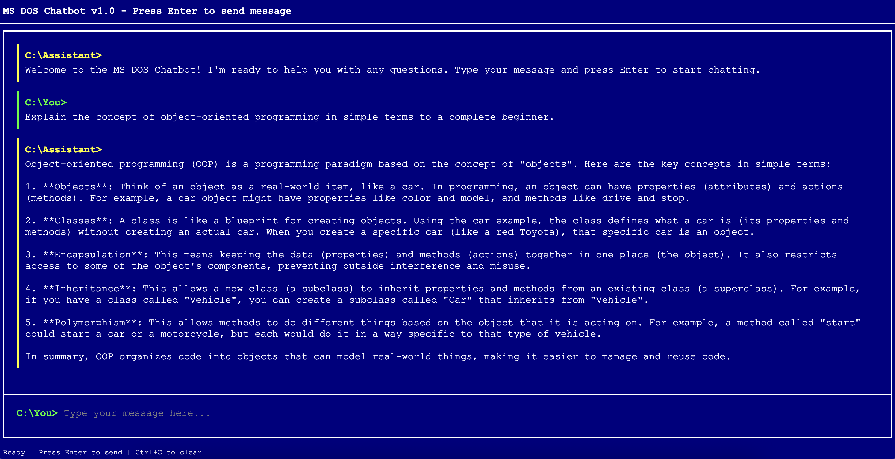
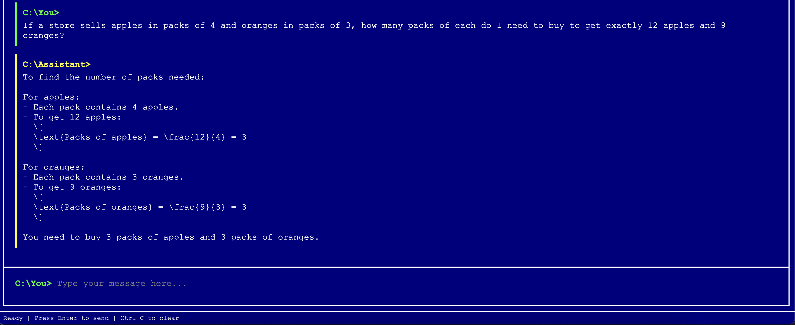

<h1 align="center" id="heading">Assignment 1: Vibe Checking</h1>

### Main Assignment

This assignment will "vibe check" my AI chatbot app - DOSGPT - [GitHub Repo](https://github.com/anilsharmay/AI-Engineer-Challenge)

#### A Note on Vibe Checking

>"Vibe checking" is an informal term for cursory unstructured and non-comprehensive evaluation of LLM-powered systems. The idea is to loosely evaluate our system to cover significant and crucial functions where failure would be immediately noticeable and severe.
>
>In essence, it's a first look to ensure your system isn't experiencing catastrophic failure.

#### 🏗️ Activity #1:

Please evaluate your system on the following questions:

1. Explain the concept of object-oriented programming in simple terms to a complete beginner. 
    
    

    

    - Aspect Tested: 
        - Accuracy 
    - Obervations:
        - The responses answered the question accurately using appropriate analogies 
        - The text formatting seems to be broken e.g., markdown formatting

2. Read the following paragraph and provide a concise summary of the key points.
Copied text from the Engadget article about all announcements made at the recent Apple event - [Link](https://www.engadget.com/mobile/smartphones/everything-apple-revealed-at-the-iphone-17-launch-event-iphone-air-iphone-17-pro-airpods-pro-3-and-more-171028663.html)

    

    
 

    - Aspect Tested: 
        - Accuracy
        - If all main details and products are captured
    - Observations:
        - All essential details captured
        - (Surprised!) The MS DOS theme is maintained in the formatting of the response
3. Write a short, imaginative story (100–150 words) about a robot finding friendship in an unexpected place.

    

    

    - Aspect Tested:
        - Task completion
        - Creativity
    - Observations:
        - Tasks are being completed
        - Acceptable stories
        - The DOS theme is being applied to the response format sporadically.
4. If a store sells apples in packs of 4 and oranges in packs of 3, how many packs of each do I need to buy to get exactly 12 apples and 9 oranges?

    

    

    - Aspect Tested:
        - Logic and Reasoning abilities
    - Observations:
        - The step  by step reasoning logic is accurate
        - The final answer is accurate
        - Same formatting issues with markup

5. Rewrite the following paragraph in a professional, formal tone: 

Picked up text from a Reddit post about Pixel 10 to be re-written in formal tone - [LINK](https://www.reddit.com/r/GooglePixel/comments/1mw2i0i/pixel_10_seems_to_be_the_right_direction_dont/).

    

    - Aspect Tested:
        - Task completion
        - Accuracy
        - Refining the output
    - Observations:
        - The rewriting task was completed with acceptable quality
        - The app doesnt seem to have "memory" to improve on previously generated output
        - The output lost the "first person" tone that was part of the input text

This "vibe check" now serves as a baseline, of sorts, to help understand what holes your application has.

#### ❓Question #1:

What are some limitations of vibe checking as an evaluation tool?
##### ✅ Answer:
- Subjective: There aren't any formal requirements, criteria, or constraints. What is acceptable for one might not be true for others. Leaves room for personal interpretation and biases. 
- The final "judgement" is not transparent and cannot be explained to others.
- Does not quantify any metrics around accuracy or performance,
- Prone to weigh aesthetics and presentation more over actual performance. e.g., in the group exercise about explaining OOP concepts, the formatting errors impacted judgement of the app, ignoring the fact that the content was accurate and on point. 
- Hard to establish quality or reproduce the testing without manual, human intervention, as they involve personal "intuition".
- No way to compare different implementations as there are no comparative metrics. 

