# YouTube RAG Architecture Diagram

```mermaid
graph TB
    %% Input Layer
    YT_URL["🎥 YouTube URL<br/>https://youtube.com/watch?v=..."]
    
    %% YouTube Transcript Processing
    YT_LOADER["📝 YouTubeTranscriptLoader<br/>• Extract video ID<br/>• Handle URL patterns<br/>• Error handling"]
    YT_API["🔗 YouTube Transcript API<br/>• Fetch transcript segments<br/>• Language support<br/>• Error handling"]
    
    %% Text Processing
    TRANSCRIPT["📄 Raw Transcript<br/>• Full text content<br/>• Segment metadata<br/>• Video metadata"]
    DOC_METADATA["📋 Document with Metadata<br/>• get_document_with_metadata()<br/>• Combined text + metadata<br/>• Ready for chunking"]
    SPLITTER["✂️ CharacterTextSplitter<br/>• Chunk size: 500<br/>• Overlap: 100<br/>• Preserve context"]
    CHUNKS["📦 Text Chunks<br/>• Multiple segments<br/>• Basic chunks only<br/>• No metadata yet"]
    CHUNK_METADATA["🏷️ Chunk Metadata Creation<br/>• Inherit parent metadata<br/>• Add chunk_id, chunk_length<br/>• Create chunks_with_metadata"]
    CHUNKS_WITH_META["📦 Chunks with Metadata<br/>• Text + metadata combined<br/>• Ready for embedding<br/>• Full context preserved"]
    
    %% Vector Database
    EMBEDDING["🧠 EmbeddingModel<br/>• OpenAI text-embedding-3-small<br/>• Async processing<br/>• Vector generation"]
    VECTOR_DB["🗄️ VectorDatabase<br/>• Store vectors + metadata<br/>• Cosine similarity<br/>• Metadata retrieval"]
    
    %% RAG Pipeline
    USER_QUERY["❓ User Query<br/>• Natural language question<br/>• About video content"]
    RETRIEVAL["🔍 Similarity Search<br/>• search_by_text(query, k=3, include_metadata=True)<br/>• Most relevant chunks<br/>• Similarity scores"]
    CONTEXT["📋 Retrieved Context<br/>• Relevant chunks<br/>• Video metadata<br/>• Similarity scores"]
    
    %% LLM Processing
    PROMPTS["📝 Prompt Engineering<br/>• System prompt<br/>• User prompt with context<br/>• YouTube-specific instructions"]
    LLM["🤖 ChatOpenAI<br/>• GPT model<br/>• Context-aware responses<br/>• Video-specific answers"]
    
    %% Output
    RESPONSE["💬 Final Response<br/>• Markdown formatted<br/>• Video context included<br/>• Pretty display"]
    
    %% Error Handling
    ERROR_HANDLING["⚠️ Error Handling<br/>• No transcript found<br/>• Transcripts disabled<br/>• Video unavailable<br/>• API errors"]
    
    %% Flow connections
    YT_URL --> YT_LOADER
    YT_LOADER --> YT_API
    YT_API --> TRANSCRIPT
    YT_API --> ERROR_HANDLING
    
    TRANSCRIPT --> DOC_METADATA
    DOC_METADATA --> SPLITTER
    SPLITTER --> CHUNKS
    CHUNKS --> CHUNK_METADATA
    CHUNK_METADATA --> CHUNKS_WITH_META
    
    CHUNKS_WITH_META --> EMBEDDING
    EMBEDDING --> VECTOR_DB
    
    USER_QUERY --> RETRIEVAL
    VECTOR_DB --> RETRIEVAL
    RETRIEVAL --> CONTEXT
    
    CONTEXT --> PROMPTS
    PROMPTS --> LLM
    LLM --> RESPONSE
    
    %% Styling
    classDef inputClass fill:#e1f5fe,stroke:#01579b,stroke-width:2px
    classDef processClass fill:#f3e5f5,stroke:#4a148c,stroke-width:2px
    classDef storageClass fill:#e8f5e8,stroke:#1b5e20,stroke-width:2px
    classDef outputClass fill:#fff3e0,stroke:#e65100,stroke-width:2px
    classDef errorClass fill:#ffebee,stroke:#c62828,stroke-width:2px
    
    class YT_URL,USER_QUERY inputClass
    class YT_LOADER,YT_API,SPLITTER,CHUNK_METADATA,EMBEDDING,RETRIEVAL,PROMPTS,LLM processClass
    class TRANSCRIPT,DOC_METADATA,CHUNKS,CHUNKS_WITH_META,VECTOR_DB,CONTEXT storageClass
    class RESPONSE outputClass
    class ERROR_HANDLING errorClass
```

## Key Components

### 1. **YouTube Transcript Ingestion**
- **YouTubeTranscriptLoader**: Extracts video ID from various YouTube URL formats
- **YouTube Transcript API**: Fetches transcript segments with error handling
- **Error Handling**: Manages cases where transcripts are unavailable

### 2. **Text Processing Pipeline**
- **CharacterTextSplitter**: Chunks transcript into manageable pieces
- **Metadata Preservation**: Maintains video information throughout processing

### 3. **Vector Database**
- **EmbeddingModel**: Converts text chunks to vector embeddings
- **VectorDatabase**: Stores vectors with associated metadata
- **Similarity Search**: Uses `search_by_text(query, k=3, include_metadata=True)` to retrieve most relevant chunks

### 4. **RAG Pipeline**
- **YouTubeRAGPipeline**: Specialized pipeline for YouTube content
- **Prompt Engineering**: YouTube-aware system and user prompts
- **Context Integration**: Combines retrieved chunks with video metadata

### 5. **Response Generation**
- **ChatOpenAI**: Generates context-aware responses
- **Pretty Display**: Markdown-formatted output with video context

## Data Flow

1. **Input**: YouTube URL → Video ID extraction
2. **Ingestion**: Transcript API → Raw transcript text
3. **Document Preparation**: Raw transcript → Document with metadata
4. **Text Processing**: Document → Text splitting → Basic chunks
5. **Metadata Creation**: Basic chunks → Chunks with metadata
6. **Embedding**: Chunks with metadata → Vector embeddings
7. **Storage**: Vectors + metadata → Vector database
8. **Query**: User question → search_by_text(query, k=3, include_metadata=True)
9. **Retrieval**: Relevant chunks + metadata → Context
10. **Generation**: Context + prompts → LLM response
11. **Output**: Formatted response with video context
