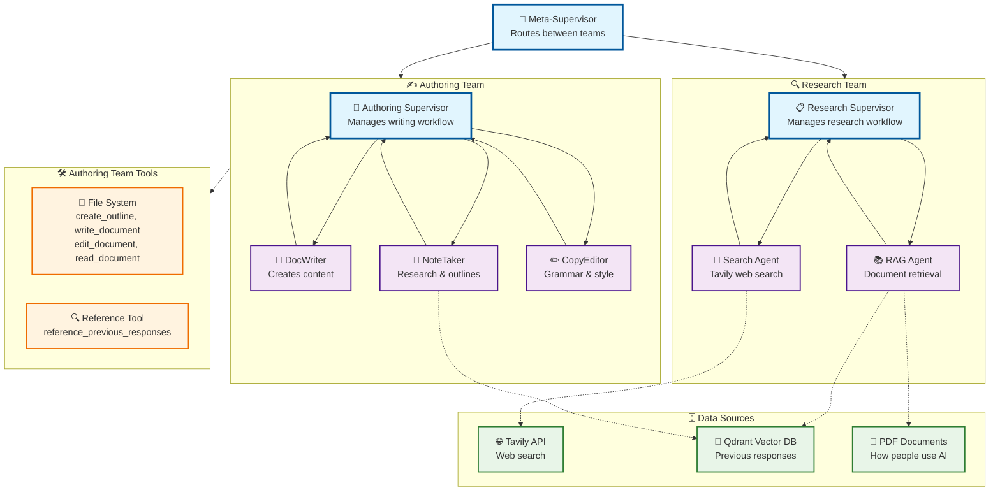

# Multi-Agent System Architecture

This document contains the Mermaid diagram for the hierarchical multi-agent workflow system.

## Architecture Diagram

## Key Components

### 🎯 Meta-Supervisor Level
- **Meta-Supervisor**: Routes tasks between the Research and Authoring teams

### 🔍 Research Team
- **Research Supervisor**: Manages the research workflow
- **Search Agent**: Uses Tavily API for web search
- **RAG Agent**: Retrieves information from documents and previous responses

### ✍️ Authoring Team  
- **Authoring Supervisor**: Manages the writing workflow
- **DocWriter**: Creates content using file tools
- **NoteTaker**: Creates outlines and references previous work
- **CopyEditor**: Handles grammar, spelling, and style

### 🗄️ Data Sources
- **Tavily API**: Web search capabilities
- **Qdrant Vector DB**: Previous cohort responses
- **PDF Documents**: "How people use AI" dataset

### 🛠️ Authoring Team Tools
- **File System**: Document creation, editing, reading tools (Authoring Team only)
- **Reference Tool**: Access to previous responses (Authoring Team only)

## Flow Characteristics
- **Hierarchical**: Meta-supervisor → Team supervisors → Individual agents
- **Bidirectional**: Agents report back to their supervisors
- **Tool Integration**: Research Team uses web search and RAG; Authoring Team uses file system and reference tools
- **Color-coded**: Different node types have distinct styling
