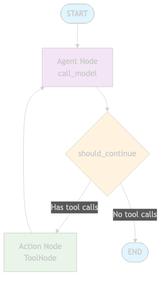
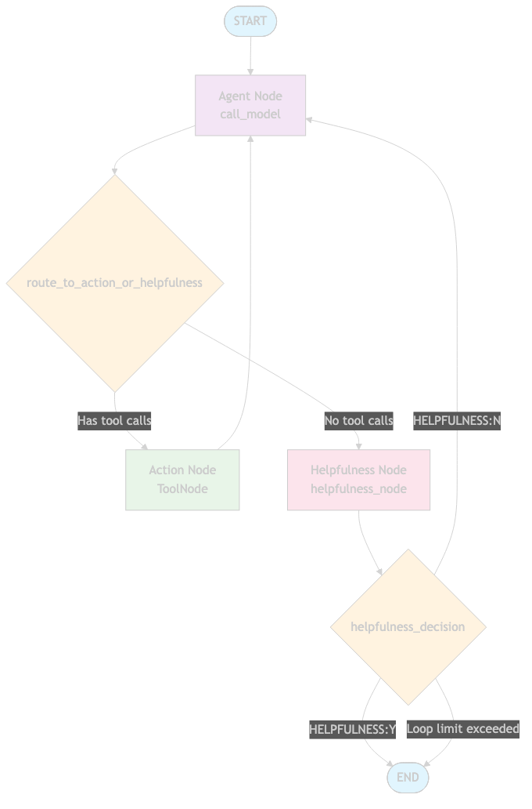

# LangGraph Agent Diagrams

Visual representations of both agent graphs in the LangGraph platform.

## 📊 Agent Flow Diagrams

### Simple Agent

**Flow:**
1. **START** → **Agent Node** (call_model)
2. **Agent Node** → **Decision** (should_continue)
3. **Decision**:
   - If tool calls needed → **Action Node** (ToolNode)
   - If no tool calls → **END**
4. **Action Node** → **Agent Node** (loop back)

**Features:**
- ✅ Simple linear flow with tool calling
- ✅ Direct termination when no tools needed
- ❌ No quality assurance loop

---

### Agent with Helpfulness Check

**Flow:**
1. **START** → **Agent Node** (call_model)
2. **Agent Node** → **Route Decision** (route_to_action_or_helpfulness)
3. **Route Decision**:
   - If tool calls needed → **Action Node** (ToolNode)
   - If no tool calls → **Helpfulness Node** (helpfulness_node)
4. **Action Node** → **Agent Node** (loop back)
5. **Helpfulness Node** → **Helpfulness Decision** (helpfulness_decision)
6. **Helpfulness Decision**:
   - If helpful (Y) → **END**
   - If not helpful (N) → **Agent Node** (retry)
   - If loop limit exceeded → **END**

**Features:**
- ✅ Helpfulness evaluation after each response
- ✅ Retry mechanism for unhelpful responses
- ✅ Loop protection (max 10+ messages)
- ✅ Quality assurance through helpfulness checking

## 🔄 Key Differences

| Feature | Simple Agent | Helpfulness Agent |
|---------|-------------|-------------------|
| **Quality Check** | ❌ None | ✅ Helpfulness evaluation |
| **Retry Logic** | ❌ No retry | ✅ Retry on unhelpful responses |
| **Loop Protection** | ❌ Not needed | ✅ Max 10+ messages |
| **Complexity** | 🟢 Simple | 🟡 Moderate |
| **Use Case** | Basic tool calling | Quality-assured responses |

## 🛠️ Available Tools

Both agents have access to:
1. **Tavily Search** - Web search capabilities
2. **ArXiv Query** - Academic paper search  
3. **RAG Tool** - Local document retrieval from PDFs

## 🎯 When to Use Which Agent

### Simple Agent
- ✅ Basic tool calling needs
- ✅ Simple Q&A with tool access
- ✅ Performance-critical applications
- ✅ When you trust the model's responses

### Agent with Helpfulness
- ✅ Quality assurance is important
- ✅ Complex queries requiring detailed responses
- ✅ When you want to ensure helpful responses
- ✅ Research and analysis tasks