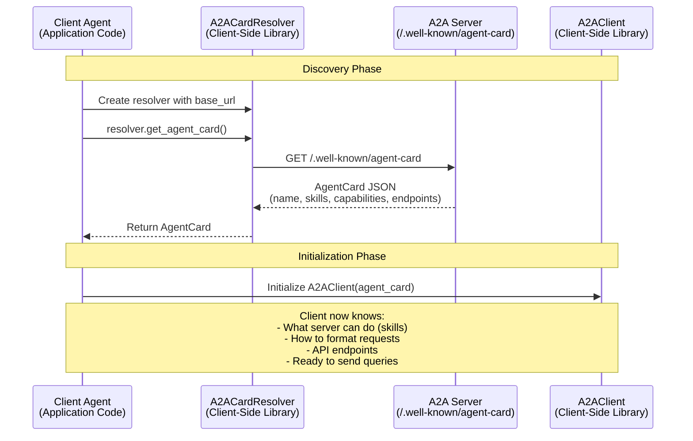
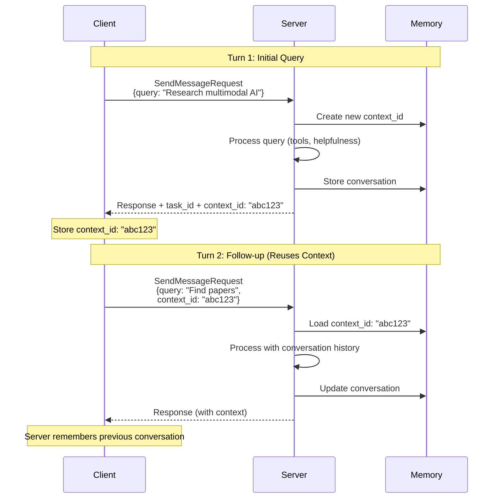
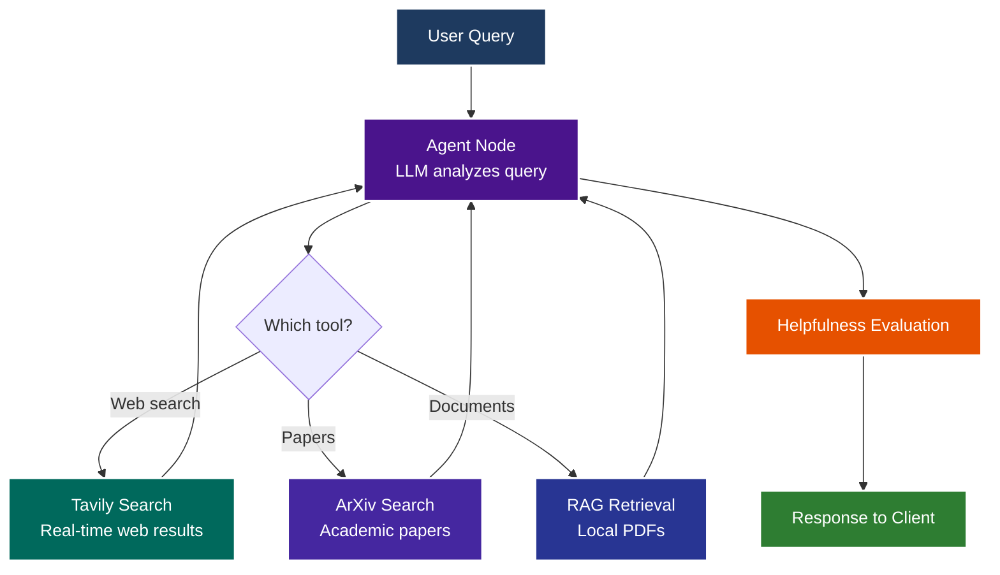
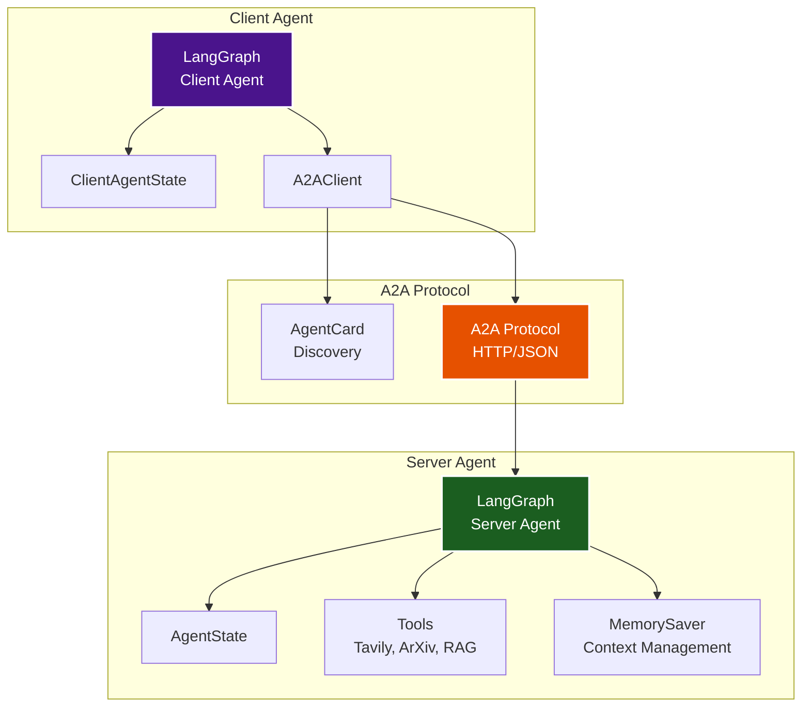
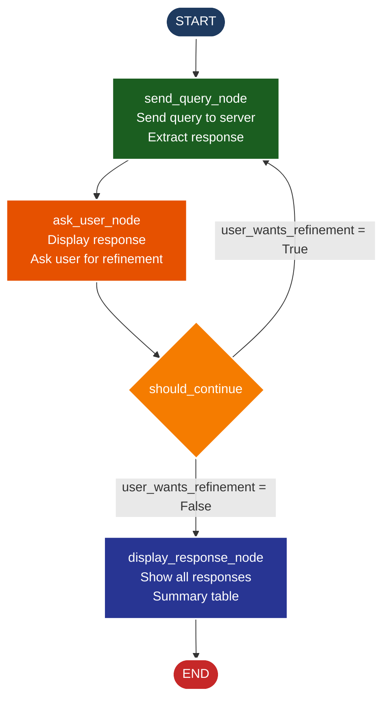
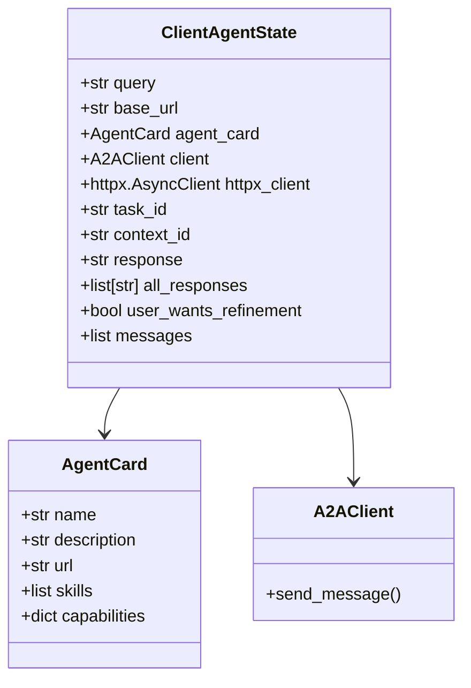
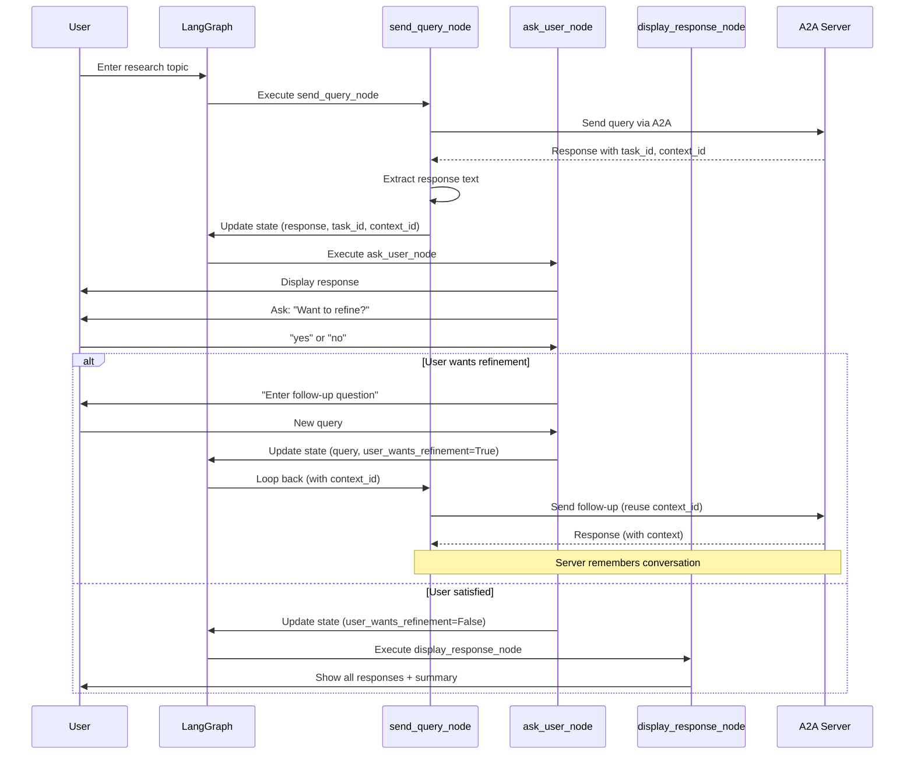
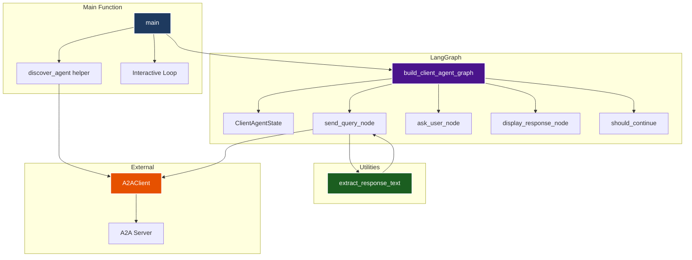

# Client-Server Interaction Diagram

This document contains Mermaid diagrams visualizing the interactions between the client agent and server agent using the A2A protocol.

## A2A Protocol Discovery Flow

## Multi-Turn Conversation Flow

## Server Side Agent - Execution Flow

## Key Components Interaction

## Current Client Agent Implementation

### Client Agent Graph Flow

### Client Agent State Structure

### User-Driven Refinement Loop

### Component Architecture

---

## Notes

- **Discovery**: Happens once at the start, then reused for all queries
- **Context Reuse**: `context_id` is reused to maintain conversation history
- **State Management**: Each node updates the state, which flows through the graph
- **Tool Execution**: Server agent decides which tools to use based on the query
- **Memory**: Server maintains conversation history per `context_id` using `MemorySaver`

