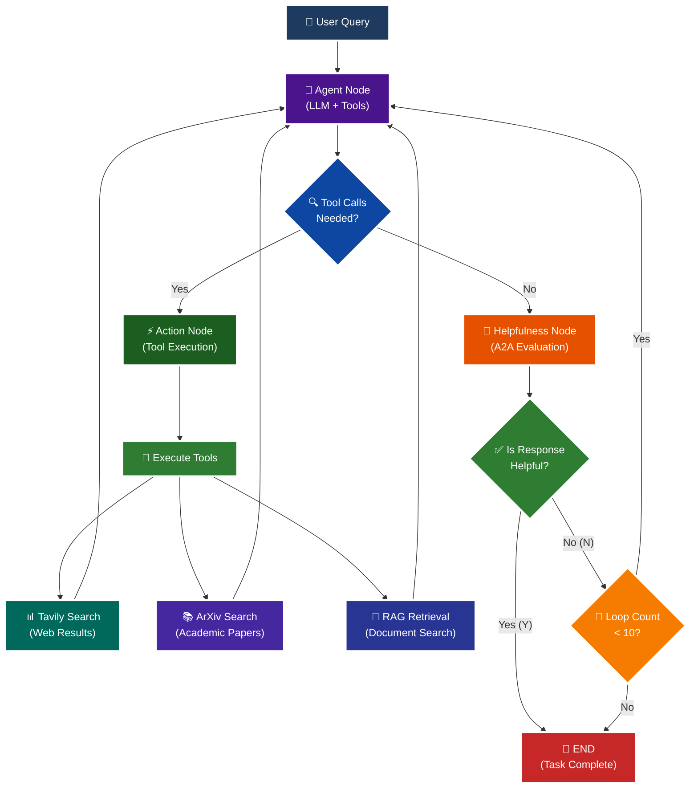

<p align = "center" draggable="false" >
</p>

## <h1 align="center" id="heading">Session 15: Build & Serve an A2A Endpoint for Our LangGraph Agent</h1>

| 📰 Session Sheet | ⏺️ Recording     | 🖼️ Slides        | 👨‍💻 Repo         | 📝 Homework      | 📁 Feedback       |
|:-----------------|:-----------------|:-----------------|:-----------------|:-----------------|:-----------------|
| [Session 15: Agent2Agent Protocol & Agent Ops](https://www.notion.so/Session-15-Agent2Agent-Protocol-Agent-Ops-26acd547af3d807c9fcdcc8864a6608a) |[Recording!](https://us02web.zoom.us/rec/share/Iz9bYK2w3p4FrtspRgMW4JKKxAlBVy1lKA-Xi99MzL7sqiLyHHVyAmyAq203HlqI.FvkopZBYLuYyCCu0) (Lyk+4@LS) | [Session 15 Slides](https://www.canva.com/design/DAG3HTQCrYs/Q2Oil7xFzz4DFEgmXdSGgg/edit?utm_content=DAG3HTQCrYs&utm_campaign=designshare&utm_medium=link2&utm_source=sharebutton) | You are here! | [Session 15 Assignment: A2A](https://forms.gle/fKTXjMJZHLReENUW9) | [AIE8 Feedback 9/16](https://forms.gle/LhGHKygFT3bfLqfS9)

# A2A Protocol Implementation with LangGraph

This session focuses on implementing the **A2A (Agent-to-Agent) Protocol** using LangGraph, featuring intelligent helpfulness evaluation and multi-turn conversation capabilities.

## 🎯 Learning Objectives

By the end of this session, you'll understand:

- **🔄 A2A Protocol**: How agents communicate and evaluate response quality

## 🧠 A2A Protocol with Helpfulness Loop

The core learning focus is this intelligent evaluation cycle:



# Build 🏗️

Complete the following tasks to understand A2A protocol implementation:

## 🚀 Quick Start

```bash
# Setup and run
./quickstart.sh
```

```bash
# Start LangGraph server
uv run python -m app
```

```bash
# Test the A2A Serer
uv run python app/test_client.py
```

### 🏗️ Activity #1:

Build a LangGraph Graph to "use" your application.

Do this by creating a Simple Agent that can make API calls to the 🤖Agent Node above through the A2A protocol. 

### ❓ Question #1:

What are the core components of an `AgentCard`?

##### ✅ Answer:

The core components of an `AgentCard` are:

1. **`name`** - The display name of the agent (e.g., "General Purpose Agent")
2. **`description`** - A human-readable description of what the agent does and its capabilities
3. **`url`** - The base URL where the agent service is accessible (e.g., `http://localhost:10000/`)
4. **`version`** - The version string of the agent (e.g., "1.0.0")
5. **`default_input_modes`** - The content types/formats the agent accepts as input (typically from `Agent.SUPPORTED_CONTENT_TYPES`)
6. **`default_output_modes`** - The content types/formats the agent can produce as output (typically from `Agent.SUPPORTED_CONTENT_TYPES`)
7. **`capabilities`** - An `AgentCapabilities` object that specifies features like:
   - `streaming` - Whether the agent supports streaming responses
   - `push_notifications` - Whether the agent supports push notifications
8. **`skills`** - A list of `AgentSkill` objects, where each skill defines:
   - `id` - Unique identifier for the skill
   - `name` - Display name of the skill
   - `description` - What the skill does
   - `tags` - Keywords for categorization
   - `examples` - Example queries or use cases

The `AgentCard` serves as a self-describing interface card that allows other agents to discover and interact with the agent through the A2A (Agent-to-Agent) protocol.

### ❓ Question #2:

Why is A2A (and other such protocols) important in your own words?

##### ✅ Answer:

A2A (Agent-to-Agent) and similar protocols are crucial for several key reasons:

**1. Standardization & Interoperability**: A2A provides a common language for AI agents to communicate. Aagents built with different frameworks (LangGraph, LangChain, custom implementations) can seamlessly interact without requiring custom integrations for each pairing.

**2. Agent Discovery & Composition**: The protocol enables agents to discover each other's capabilities through self-describing AgentCards. This allows for dynamic composition of agent networks where specialized agents (e.g., a web search agent, a document analysis agent) can be discovered and leveraged by other agents when needed, creating a modular ecosystem.

**3. Quality Assurance**: A2A includes built-in mechanisms like helpfulness evaluation, ensuring agents can assess response quality before delivering results. This creates a feedback loop that helps maintain high standards across agent interactions.

**4. Scalability & Modularity**: Instead of building monolithic agents that try to do everything, A2A enables the creation of specialized, focused agents. When a complex task requires multiple capabilities, agents can delegate subtasks to specialized peers, resulting in more maintainable and efficient systems.

**5. Future-Proofing**: As the AI agent ecosystem grows, standardized protocols prevent fragmentation. They enable an "agent marketplace" where agents can be developed independently but work together seamlessly, similar to how microservices transformed software architecture.

**6. Transparency**: By requiring agents to declare their capabilities, input/output modes, and skills upfront, the protocol promotes transparency and reduces integration surprises. This self-documentation aspect is critical for trust and reliability in autonomous systems.

In short, A2A is like "HTTP for agents" - it's the infrastructure layer that enables the distributed AI agent ecosystem to flourish.

<details>
<summary>🚧 Advanced Build 🚧 (OPTIONAL - <i>open this section for the requirements</i>)</summary>

Use a different Agent Framework to **test** your application.

Do this by creating a Simple Agent that acts as different personas with different goals and have that Agent use your Agent through A2A. 

Example:

"You are an expert in Machine Learning, and you want to learn about what makes Kimi K2 so incredible. You are not satisfied with surface level answers, and you wish to have sources you can read to verify information."
</details>

## 📁 Implementation Details

For detailed technical documentation, file structure, and implementation guides, see:

**➡️ [app/README.md](./app/README.md)**

This contains:
- Complete file structure breakdown
- Technical implementation details
- Tool configuration guides
- Troubleshooting instructions
- Advanced customization options

# Ship 🚢

- Short demo showing running Client

# Share 🚀

- Explain the A2A protocol implementation
- Share 3 lessons learned about agent evaluation
- Discuss 3 lessons not learned (areas for improvement)

# Submitting Your Homework

## Main Homework Assignment

Follow these steps to prepare and submit your homework assignment:
1. Create a branch of your `AIE8` repo to track your changes. Example command: `git checkout -b s15-assignment`
2. Complete the activity above
3. Answer the questions above _in-line in this README.md file_
4. Record a Loom video reviewing the Simple Agent you built for Activity #1 and the results.
5. Commit, and push your changes to your `origin` repository. _NOTE: Do not merge it into your main branch._
6. Make sure to include all of the following on your Homework Submission Form:
    + The GitHub URL to the `15_A2A_LANGGRAPH` folder _on your assignment branch (not main)_
    + The URL to your Loom Video
    + Your Three Lessons Learned/Not Yet Learned
    + The URLs to any social media posts (LinkedIn, X, Discord, etc.) ⬅️ _easy Extra Credit points!_

### OPTIONAL: 🚧 Advanced Build Assignment 🚧
<details>
  <summary>(<i>Open this section for the submission instructions.</i>)</summary>

Follow these steps to prepare and submit your homework assignment:
1. Create a branch of your `AIE8` repo to track your changes. Example command: `git checkout -b s015-assignment`
2. Complete the requirements for the Advanced Build
3. Record a Loom video reviewing the agent you built and demostrating in action
4. Commit, and push your changes to your `origin` repository. _NOTE: Do not merge it into your main branch._
5. Make sure to include all of the following on your Homework Submission Form:
    + The GitHub URL to the `15_A2A_LANGGRAPH` folder _on your assignment branch (not main)_
    + The URL to your Loom Video
    + Your Three Lessons Learned/Not Yet Learned
    + The URLs to any social media posts (LinkedIn, X, Discord, etc.) ⬅️ _easy Extra Credit points!_
</details>
