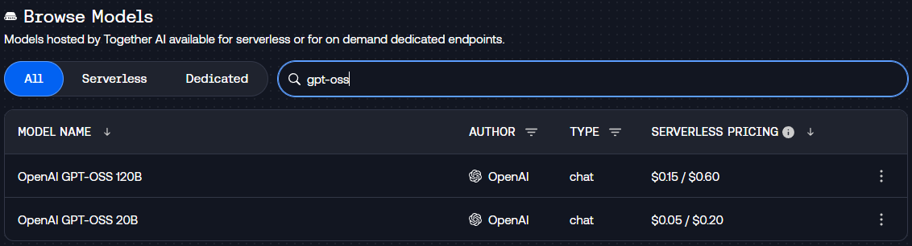
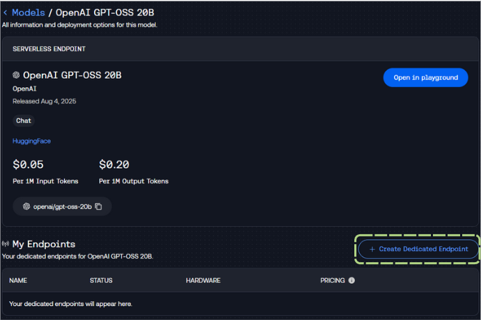

# Setting Up Your Open-Source Endpoint

> NOTE: If you do not wish to purchase $50 of compute credits for T2 (for using dedicated endpoints) you can instead skip the following set-up and simply use the serverless endpoints offered at: 

- `openai/gpt-oss-20b`

## Your Generator

First, you'll want to navigate to [api.together.ai/models](https://api.together.ai/models), and search for the model we'll be using today: 

- `gpt-oss`

We're going to select the OpenAI GPT-OSS 20B model by clicking on it:

Next, we're going to click on "Create Dedicated Endpoint" to spin up a dedicated endpoint. 

You'll want to set your settings as follows and then click "Deploy": 

> NOTE: Please ensure you have an Auto-shutdown selected - a value like `1 hour` is useful to ensure your endpoint does not spin down during class.

After you click "Deploy" - you should see the endpoint spinning up, as well as a name for your new endpoint!

> NOTE: You'll want to make sure you get an API key from together.ai as well! You can follow the instructions [here](https://docs.together.ai/reference/authentication-1)

## Your Embeddings 

Together offers serverless endpoints for embedding models, we'll be using the [BAAI-BGE-Large-1.5](https://huggingface.co/BAAI/bge-large-en-v1.5) model today!

- `BAAI/bge-large-en-v1.5`

### ❓ Question #1: 

What is the difference between serverless and dedicated endpoints?

#### ✅ Answer:

**Serverless Endpoints:**
- Managed automatically by the service provider (e.g., Together AI)
- Scale up and down automatically based on demand
- Pay-per-use pricing model (you only pay when making requests)
- May experience cold starts (initial latency when first invoked after inactivity)
- No need to manage infrastructure or provisioning
- Best for sporadic or unpredictable workloads
- Example: The `openai/gpt-oss-20b` serverless endpoint mentioned at the top of this document

**Dedicated Endpoints:**
- Provisioned specifically for your use case and always running (unless you shut them down)
- Consistent performance and lower latency (no cold starts)
- Reserved capacity ensures availability
- Pay for compute time regardless of usage (costs continue even when idle)
- Require manual management (setting auto-shutdown timers, monitoring, etc.)
- Best for production workloads with consistent demand or when you need guaranteed availability
- Example: The dedicated endpoint you create in the steps above